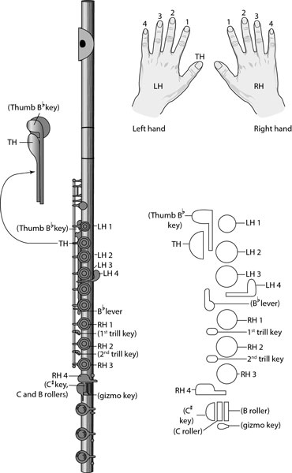

# virtual-flute

### Overview
My experience as a floutist and my passion for computer science have joined to form the Virtual Flute. This program, 
written as a web app, let's the user play the flute using matching keys (position-wise) on the keyboard as buttons on a flute. 

### Usage
First, add the js:
```html
<script src="vflute.js"></script>
```
Then, reference all necessary audio files using the file name as the tag id:
```html
<audio id="m-D"><source src="m-D"></audio>
<audio id="m-E"><source src="m-E"></audio>
<audio id="m-D"><source src="m-F"></audio>
<audio id="m-D"><source src="m-G"></audio>
<audio id="m-E"><source src="m-A"></audio>
...
```
### Key Documentation
A diagram of terms I will be using in this documentation:
<br>
<br>
TH - space<br>
LH1 - F<br>
LH2 - D<br>
LH3 - S<br>
LH4 - A<br>
RH1 - J<br>
RH2 - K<br>
RH3 - L<br>
more soon to come...
